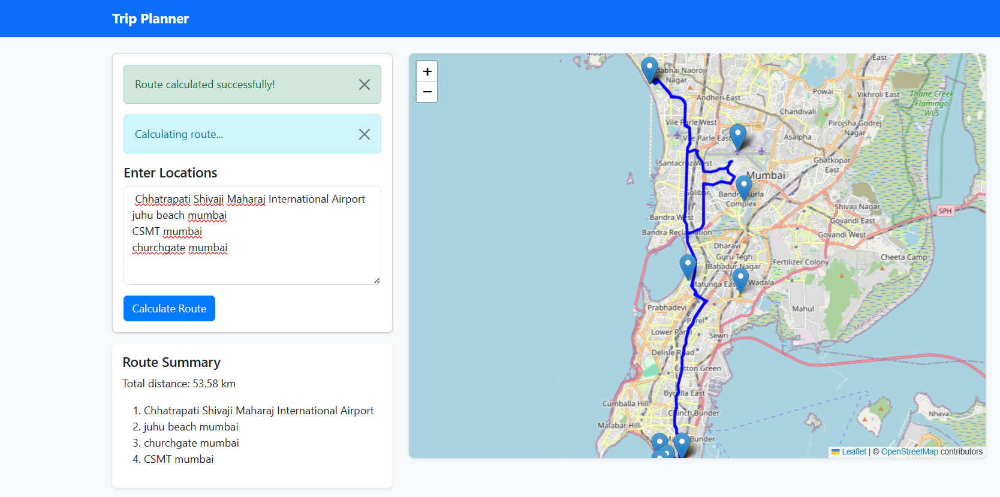

# Road Trip Planner Web App

This is a web application built using Python Flask, CSS, JS, and HTML to help users plan their road trips using metaheuristics and optimization algorithms at backend. 




##

## Installation

1. Clone the repository to your local machine.
2. Create a virtual environment using `venv`:
    ```
    python -m venv venv
    ```
3. Activate the virtual environment:
    - For Windows:
      ```
      venv\Scripts\activate
      ```
    - For macOS/Linux:
      ```
      source venv/bin/activate
      ```
4. Install the required dependencies:
    ```
    pip install -r requirements.txt
    ```


## Usage

1. Run the Flask application:
    ```
    flask run
    ```
2. Open your web browser and navigate to `http://localhost:5000`.


3. Use the interactive web app to plan your road trip by inputting your desired destinations and preferences.
4. The metaheuristics algorithm will optimize the route based on your inputs and display the best road trip plan.

Enjoy your road trip planning with our web app!
